# Hi, My name is Jinwon Jung

### I am a Junior Game Developer.

> **💡 I'm interested in developing games using various tools, and also implementing various contents and producing creative results.**

---

### Tech & Tools

| Category | Item |
|----------|------|
| **Engine** |   |
| **Language** |   |
| **Additional** |   |

---

### GitHub Streak

---

### 🏆 Achievements

### 📅 Isometric Calendar

### 🈷️ Languages

<!--
**JoungJinwon/JoungJinwon** is a ✨ _special_ ✨ repository because its `README.md` (this file) appears on your GitHub profile.

Here are some ideas to get you started:

- 🔭 I'm currently working on ...
- 🌱 I'm currently learning ...
- 👯 I'm looking to collaborate on ...
- 🤔 I'm looking for help with ...
- 💬 Ask me about ...
- 📫 How to reach me: ...
- 😄 Pronouns: ...
- ⚡ Fun fact: ...
-->
